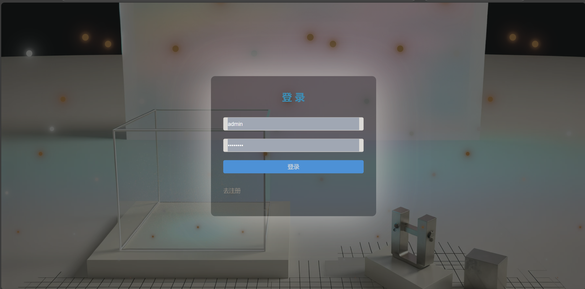
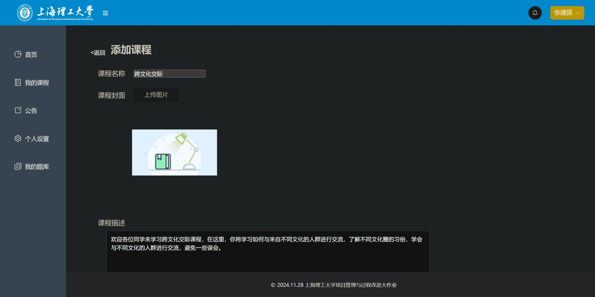
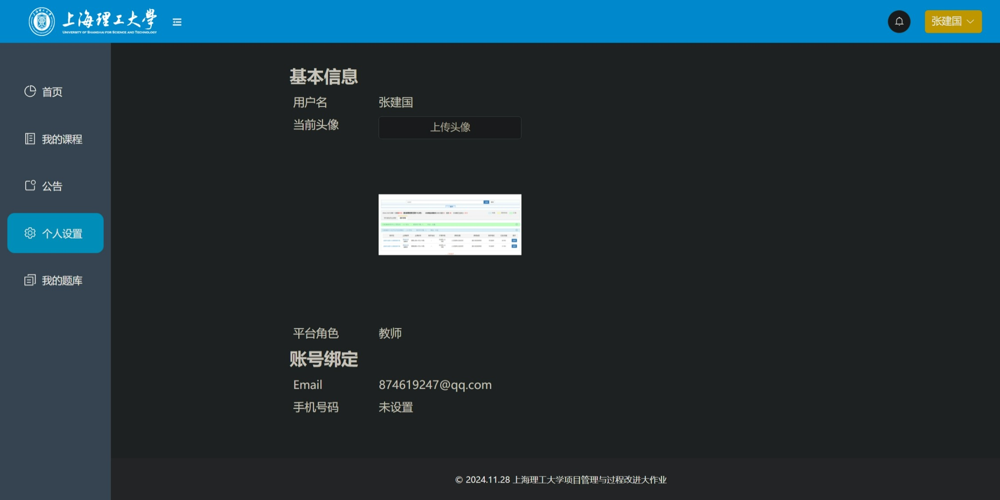
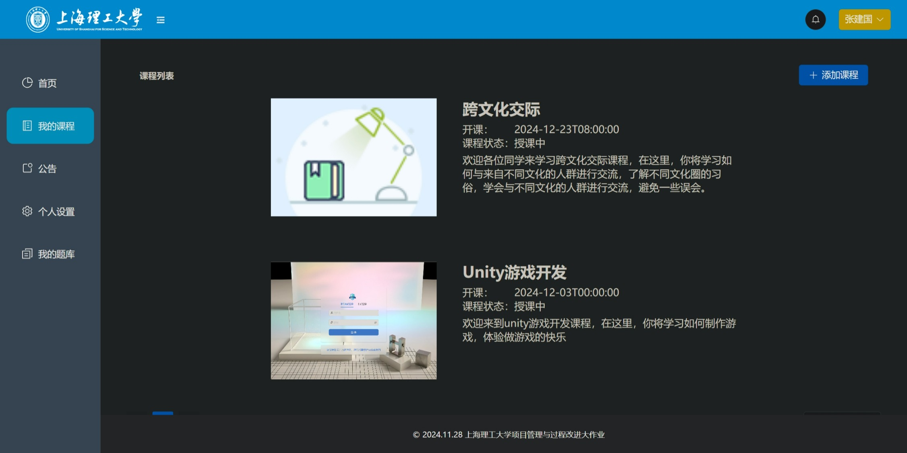

# 说明

这是上海理工大学项目管理与过程改进课程的课程作业，要求实现一个在线的课程管理系统。

## 演示效果：









后端地址：https://github.com/caodong0225/USST_SPM_backend

## 如何运行？

首先使用：

```bash
npm run install
```

完成相关包的安装

然后使用：

```bash
npm run dev
```

完成启动
